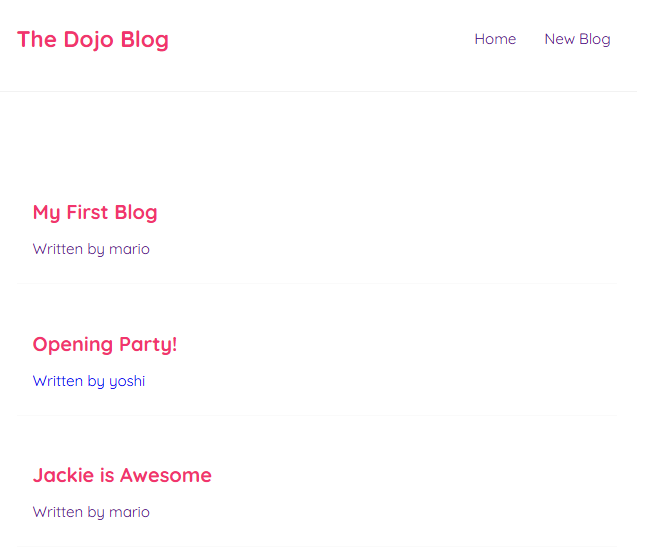
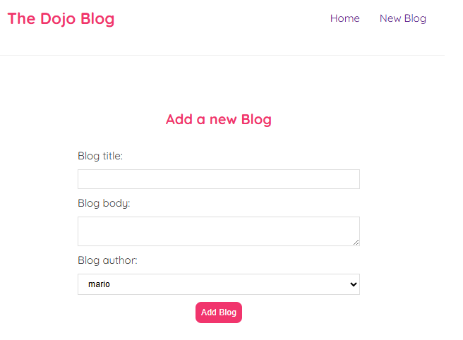

Dojo-Blog (React)

This project was bootstrapped with [Create React App](https://github.com/facebook/create-react-app).

📌 Overview
This is a Dojo Blog web application built using the ReactJS. The app allows users to add, edit, delete, and manage blogs.

🛠️ Tech Stack
Backend: NodeJs
Frontend: HTML, CSS, ReactJS
Database: JSON server

🚀 Features\n
✅ Add new blogs with title, description, and author.
❌ Delete blog
🗂️ View all tasks

How it looks:

🔧 Installation & Setup
1️⃣ Prerequisites
Ensure you have the following installed:

node 
Run `node -v` to check the version

2️⃣ Clone the Repository
git clone https://github.com/yourusername/The-Dojo-Blog.git
cd The-Dojo-Blog

📌 API Endpoints
GET blogs
DELETE blog {id}
CREATE blog {id}

## Available Scripts
In the project directory, you can run:

### `npm start`

Runs the app in the development mode.\
Open [http://localhost:3000](http://localhost:3000) to view it in your browser.

The page will reload when you make changes.\
You may also see any lint errors in the console.

### `npm test`

Run the server
Run `npx json-server --watch data/db.json --port 8000

### `npm run build`

Builds the app for production to the `build` folder.\
It correctly bundles React in production mode and optimizes the build for the best performance.

The build is minified and the filenames include the hashes.\
Your app is ready to be deployed!

See the section about [deployment](https://facebook.github.io/create-react-app/docs/deployment) for more information.

## Learn More

You can learn more in the [Create React App documentation](https://facebook.github.io/create-react-app/docs/getting-started).

To learn React, check out the [React documentation](https://reactjs.org/).

### Making a Progressive Web App

This section has moved here: [https://facebook.github.io/create-react-app/docs/making-a-progressive-web-app](https://facebook.github.io/create-react-app/docs/making-a-progressive-web-app)

### Advanced Configuration

This section has moved here: [https://facebook.github.io/create-react-app/docs/advanced-configuration](https://facebook.github.io/create-react-app/docs/advanced-configuration)

### Deployment

This section has moved here: [https://facebook.github.io/create-react-app/docs/deployment](https://facebook.github.io/create-react-app/docs/deployment)

### `npm run build` fails to minify

This section has moved here: [https://facebook.github.io/create-react-app/docs/troubleshooting#npm-run-build-fails-to-minify](https://facebook.github.io/create-react-app/docs/troubleshooting#npm-run-build-fails-to-minify)
